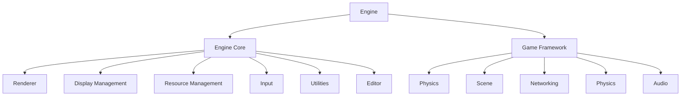

```mermaid
flowchart TD
A[Engine] --> B[Engine Core]
A --> C[Game Framework]
B --> D[Renderer]
B --> E[Display Management]
B --> F[Resource Management]
B --> J[Input]
B --> H[Utilities]
B --> I[Editor]


    C --> K[Physics]
    C --> L[Scene]
    C --> M[Networking]
    C --> N[Physics]
    C --> G[Audio]
```